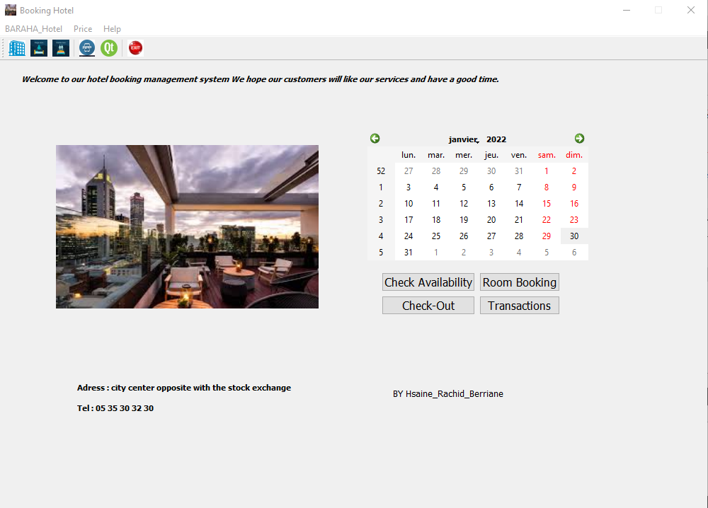
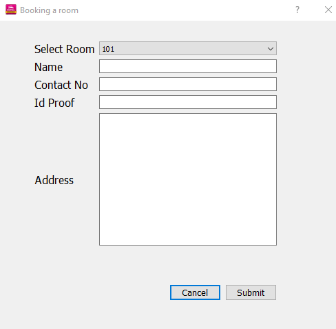
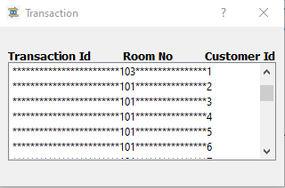
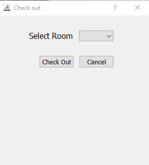
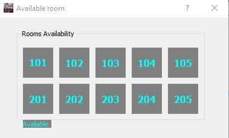

<h1 align="center">System Hotel Management</h1>

   System Hotel Management

<h1 align="center">Introduction</h1>

As part of our first year in engineering, specializing in robotics and cobotics at the School of Digital Engineering and Artificial Intelligence at the euromed University of Fez, our professor proposed to us to create an application as a final project after we are finished the course of human-machine interaction using **QT designer c++**.

<h1 align="center">Thankfulness</h1>

First of all, to begin this report, we would like to express our thanks to
our professor.***Belcaid Anass*** who has not stopped encouraging us during the
duration of the project, as well as its generosity in terms of training and supervision,
for the quality of his exceptional coaching, his patience, his rigour and his
availability during our preparation of this project.
We would like to thank my team who contributed to the success of our project
tutor who helped us a lot in the development of our project.

<h1 align="center">About Application</h1>

System Hotel Management is an appliaction created by **Qt Creator using C++**,is an application allow clients to check the available of rooms then you can book a room available,after this operation we will show your id_number that is mean your number as client in our service when you click on **Transaction Button**,finnally when you want to leave the hotel just check out for make the room available for other client.

<h1 align="center">Steps To use Application</h1>

First of all ou should to do it to go the menu bar:
1. click on **BARAHA HOTEL** then**About Hotel** to show information about our services.
2. click on **Price** to know the price of each room category.
3.  Check the availibilty of the rooms.
4.  Now, we move to button**roombooking**,click on it, fill in the form and click on **sumbit**to valid the reservation.
5.  If you wnt to know your id as client,you should click on **trasaction**.
6.  Know you can quit the application,go to menu bar, click on **BARAHA HOTEL** then**Exit**
7.  When you want to check out the hotel,go to**Button: check out** and choose the number of room selected in your reservation, check out and automaticaly you will quit the application.
8.  We hope you had a good time. 

<h1 align="center">How Application is built?</h1>

1. Our application contain five forms,each one have a specific task to do,the first one is the **mainwindow.ui**:Is the principle form, it contain:menubar,toolbar,Qaction,PushButtons,picture of hotel,calendar...you will find in the table bellow details of forms that remain:

| Form        | Execution   | Description   |
| :---        |    :----:   | :---          |
| bookroomdialog.ui      | 
 
       | This form contain a dialog that client should fill in when he/she click on **room booking** after checking the availibillity of rooms,you should be select a room and put all information. it contain labels,combobox,lineedit,two pushbutton and verticalspacer   |
| transaction.ui   | 
 
        | This form contain label and a listwidget that show the id of client and and the numer of room selected       |
| chechoutdialog.ui   | 
 
          | This form is a dialog contain a combobox,label and pushbutton to valid your check out      |
| roomavailabledialog.ui   | 
 
          | This form is a dialog contain labels for number of rooms and agroupbox gather this labels       |

2. The **menubar** contain **tree menu**each one have two **QAcion**,the first one**BARAHA Hotel**,the first action display information about the hotel,the second to quit the application,the second one **Price** the both action display the price,the last one **Help** hive you inforamation about QT and the application.
3. Each Action have an icon and eachdailog have as well an icon.
4. THe size of all foems is fixed.
5. The toolbar contain all icons of the actions.
6. We are trying to use maximum concepts and tools in this course.
7. The application is built using **MVC Model** especially SQLDATABASE.is responsible for managing of database .
8. Also we are using **Item Based** especially Listwidget in the form transaction.

<h2 align="center">Compilation</h2>

https://user-images.githubusercontent.com/93345744/152611308-d8e4f65a-4ef6-4ca6-baa7-7d41b1cbfbc7.mp4

https://user-images.githubusercontent.com/93345744/152612941-2dcb4d6d-80e6-464c-801b-64d4f34379b4.mp4

<h1 align="center">Conclusion</h1>

<h1 align="center">Contact</h1>

ayoub.hsaine@eidia.ueuromed.org

achraf.rachid@eidia.ueuromed.org

achraf.berriane@eidia.ueuromed.org

